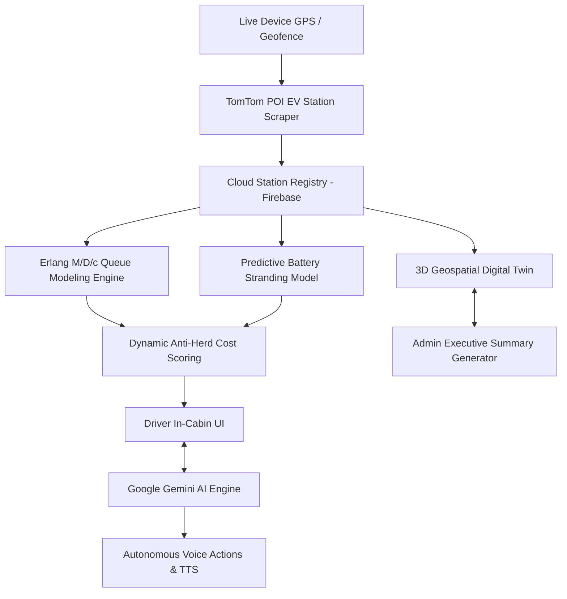

<div align="center">

# ⚡ ZEUS OS

```
███████╗███████╗██╗   ██╗███████╗
╚══███╔╝██╔════╝██║   ██║██╔════╝
  ███╔╝ █████╗  ██║   ██║███████╗
 ███╔╝  ██╔══╝  ██║   ██║╚════██║
███████╗███████╗╚██████╔╝███████║
╚══════╝╚══════╝ ╚═════╝ ╚══════╝
```

### Autonomous EV Navigation, Charging Orchestration & Municipal Digital Twin

<p align="center">
  <strong>Real-time EV routing • Dynamic charging allocation • Anti-herd orchestration • 3D municipal intelligence</strong>
</p>

<p align="center">
  <a href="#-quick-download-links--binaries"><strong>Download App & Exe</strong></a> •
  <a href="#overview">Overview</a> •
  <a href="#system-goals">System Goals</a> •
  <a href="#key-capabilities">Capabilities</a> •
  <a href="#ai-integrations--predictive-methodologies">AI & Algorithms</a> •
  <a href="#technology-stack">Tech Stack</a> •
  <a href="#getting-started">Getting Started</a> •
  <a href="#security--financial-workflow">Security</a>
</p>

<p align="center">

[-10b981?style=for-the-badge&logo=android)](./ZEUS.apk)
[-3b82f6?style=for-the-badge&logo=windows)](./Zeus-Admin-Portable.exe)

</p>

<p align="center">

[](./ZEUS.apk)
[](./Zeus-Admin-Portable.exe)
[](https://react.dev/)
[](https://www.typescriptlang.org/)
[](https://firebase.google.com/)
[](https://developer.tomtom.com/)
[](https://deck.gl/)
[](https://ai.google.dev/)

</p>

</div>

---

## 🚀 Quick Download Links & Binaries

Get the standalone production-ready builds for mobile and desktop:

| Platform | Direct Download Link | Size | Target Audience | Description |
|---|---|---|---|---|
| 📱 **Android Mobile** | [📥 **Download `ZEUS.apk`**](./ZEUS.apk) | `5.75 MB` | EV Drivers, Scooter Pilots & Fleets | In-cabin navigation with live GPS, TomTom real-time arterial traffic, Gemini AI voice copilot, and prepaid UPI slot booking. |
| 💻 **Windows Desktop** | [📥 **Download `Zeus-Admin-Portable.exe`**](./Zeus-Admin-Portable.exe) | `93.5 MB` | Municipal Grid Authorities & Operators | Zero-install portable command center with 3D digital twin, AI voice executive reports, telemetry seeding, and dispute management. |

---

## Overview

**ZEUS OS** is an autonomous EV charging orchestration platform designed to coordinate electric-vehicle navigation, charging reservations, real-time traffic conditions, and municipal charging infrastructure.

The platform addresses a key problem in EV infrastructure:

> **A charging station can have an available charger while the surrounding road network, inbound reservations, or downstream stations are already becoming congested.**

Traditional navigation systems generally optimize for individual travel time. ZEUS OS extends this model by considering **station queues, inbound reservations, charger capacity, traffic conditions, and battery safety** when determining where an EV should charge.

ZEUS consists of two coordinated applications:

| Platform | Purpose |
|---|---|
| **ZEUS Mobile** | In-cabin EV navigation, charging discovery, reservations, battery-risk monitoring, and AI voice assistance |
| **ZEUS Command Center** | Municipal 3D digital twin for infrastructure monitoring, queue intelligence, telemetry, and payment-dispute management |

Together, these components create a feedback loop between **drivers, charging infrastructure, traffic conditions, and municipal operators**.

---

# System Goals

ZEUS OS is designed around four primary objectives:

### 01 — Prevent Charger Herding

When a station becomes available, sending every nearby EV toward the same location can simply move congestion from one station to another.

ZEUS considers:
- Current station queue
- Inbound reservations
- Charger availability
- Estimated arrival time
- Traffic conditions
- Station capacity
- Battery constraints

before recommending a charging location.

### 02 — Reduce Charging-Related Delays

Charging recommendations account for both:
$$\text{Total Trip Delay} = \text{Road Travel Time} + \text{Expected Queue \& Charging Delay}$$
rather than treating the nearest available charger as automatically optimal.

### 03 — Protect Against Battery Stranding

The routing layer evaluates whether an EV can safely reach a candidate charging station based on:
- Current state of charge (SOC)
- Estimated energy consumption
- Route distance & elevation
- Real-time traffic congestion
- Required charging energy
- Configured emergency reserve

### 04 — Provide Municipal Visibility

The ZEUS Command Center aggregates infrastructure telemetry into a geospatial digital twin, allowing operators to inspect:
- Charging demand & queue depth
- Station utilization & load
- Traffic bottlenecks
- Substation capacity
- Fleet activity
- Payment dispute resolution

---

# Key Capabilities

## 🚗 ZEUS Mobile — In-Cabin EV Companion

The Android application provides a driver-facing interface for navigation and charging orchestration.

### AI Voice Copilot
The integrated Gemini-powered copilot converts natural-language driver requests into application actions. Supported intents include:

| Intent | Function |
|---|---|
| `NAVIGATE_NEAREST` | Find and navigate to an appropriate nearby charging station |
| `NAVIGATE_GOOGLE_MAPS` | Handover turn-by-turn directions to native Google Maps |
| `BOOK_SLOT` | Start a charging reservation |
| `FILTER_FAST` | Filter for high-throughput DC chargers (100kW+) |
| `FILTER_AVAILABLE` | Filter for stations with open plugs |
| `FILTER_5KM` | Filter within 5km radius of live GPS location |
| `RAISE_PAYMENT_QUERY` | Open the payment-dispute workflow |

Example interaction:
```text
Driver:
"Find me a fast charger that I can safely reach."

        ↓

ZEUS AI Copilot (Gemini 2.5 Flash)

        ↓

Evaluate:
• Battery state
• Traffic
• Distance
• Charger power
• Queue depth
• Inbound reservations

        ↓

Recommended Charging Station & In-App / Google Maps Handover
```

### Automotive Map & Routing Engine
- **TomTom Real-Time Traffic**: Road-accurate traffic flow layer (`relative0`) color-coding live speeds across corridors.
- **Dual Navigation**: Seamless switching between In-App vector road guidance and Google Maps app handover.
- **Petrol-Bunk Style Reservations**: Reserve slots by Units (kWh), Target %, or Budget (₹) with instant UPI QR payments.

---

## 🏢 ZEUS Command Center — Municipal 3D Twin

The standalone desktop executable (`Zeus-Admin-Portable.exe`) enables operators to supervise grid stability.

- **3D Geospatial Twin**: Interactive vector map with grounded station badges and capacity telemetry.
- **On-Demand Executive Briefings**: Spoken Gemini AI executive summaries analyzing active fleet, bunk utilization, and alerts.
- **24H Fleet Telemetry Seeding**: Seed multi-bunk usage data and charge cycles across national expressways.
- **Payment Dispute Resolution**: Inspect user-submitted UPI UTRs and update ticket statuses in real time.

---

# AI Integrations & Predictive Methodologies



### 1. Mathematical Queue Optimization ($M/D/c$)
$$\rho = \frac{\lambda}{c \cdot \mu}, \quad W_q(M/D/c) \approx \frac{\rho}{1 - \rho} \cdot \frac{1}{2 c \mu} \cdot (1 + \rho)$$

### 2. Anti-Herd Combinatorial Allocation Cost Function
$$C_{i, j} = \alpha \cdot \text{Time}(i, j) + \beta \cdot W_q(j) + \gamma \cdot \left(\frac{Q_j}{C_j}\right) + \delta \cdot \text{GridStress}(j)$$

---

# Technology Stack

| Layer | Technology | Purpose |
|---|---|---|
| **In-Cabin Client (Mobile)** | React 18, TypeScript, Tailwind CSS | High-performance mobile driver interface |
| **Desktop Digital Twin** | Electron 30, Portable 7z Packager | Zero-install standalone desktop executable |
| **Mobile Runtime** | Capacitor 6, Android Studio Gradle | Native Android APK packaging |
| **Maps & Traffic** | TomTom Web SDK v6, MapLibre GL | Vector tiles, road routing, and live traffic flow |
| **Generative AI** | Google Gemini 2.5 Flash (`@google/generative-ai`) | In-cabin voice assistant & executive reports |
| **Voice & Speech** | Web Speech API (Recognition + Synthesis) | Speech-to-text (STT) and text-to-speech (TTS) |
| **Cloud & Realtime** | Firebase Firestore & Realtime Database | Real-time booking sync, telemetry, and disputes |

---

# Getting Started

### 1. Run Web Development Server
```bash
cd frontend
npm install
npm run dev
```

### 2. Build Android Debug APK
```bash
cd frontend
npm run build
npx cap sync android
cd android
./gradlew.bat assembleDebug
```
Output: [ZEUS.apk](./ZEUS.apk)

### 3. Build Windows Portable Desktop App
```bash
cd frontend
npm run electron:portable
```
Output: [Zeus-Admin-Portable.exe](./Zeus-Admin-Portable.exe)

---

# Security & Financial Workflow

- **Prepaid Merchant Identifier**: `vishalchandran6126@oksbi` (*Vishal Chandran*)
- **Automated UTR Verification**: Validates 12-digit transaction identifiers against cloud records.
- **Dispute Center**: Enables drivers to lodge tickets for locked bays and allows municipal operators to investigate and clear issues with audit notes.

---

<div align="center">
<b>Developed with ⚡ by the ZEUS Engineering Team</b>
</div>
